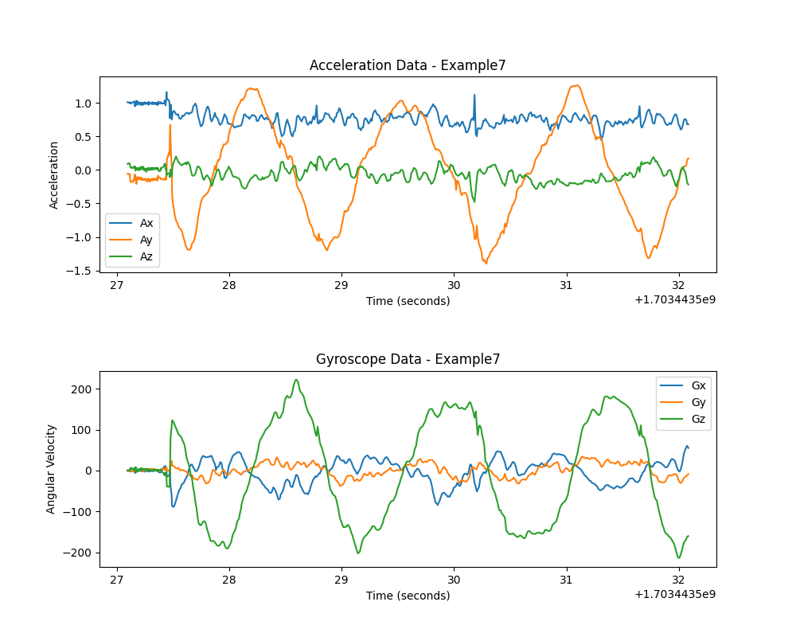

# Data Visualization for STM32 & Arduino Uno

## Overview

This repository provides a comprehensive toolset ranging from basic to advanced software/firmware layers compatible with STM32 and Arduino Uno microcontrollers. The primary focus is on creating a data acquisition and visualization system for a variety of sensors, capturing real-time data via serial communication.

## Features

- **Data Acquisition**: 
  - Stream raw data from MPU9250 sensors connected to an Arduino Uno over UART.
  - Real-time data streaming to a PC using Python.

- **Data Structuring**: 
  - Python script leveraging the Pyserial library to structure data into a CSV file.
  - Data columns: `timestamp, Ax, Ay, Az, Gx, Gy, Gz`.

- **Data Visualization**:
  - Generate signal plots from the CSV data.
  - Organize data into four folders representing output classes for a neural network model: `idle, left_right, back_forth, up_down`.

## Methodology

The repository is structured into separate methods, each representing a different step in the process. Each method is a separate directory containing:

- One or two Python scripts, depending on the use case.
- A description of the method in a TXT file, acting as the method's README.

## Examples
- **Acceleration data as .img**:

- **Acceleration & Gyroscope data as .img**:

- **Acceleration & Gyroscope data as a CSV**:

## Notable Achievements

Thanks to Method X2, real MPU9250 data was collected, aiding in the creation of a gesture recognition model capable of classifying 4 different hand gestures (idle, left_right, back_forth, up_down). This serves as the initial step towards developing a sophisticated smart embedded solution for soccer player activity recognition. These methods offer a solid foundation and flexibility for various use cases.

- **A Glimpse to the real data collected using method X2**:

